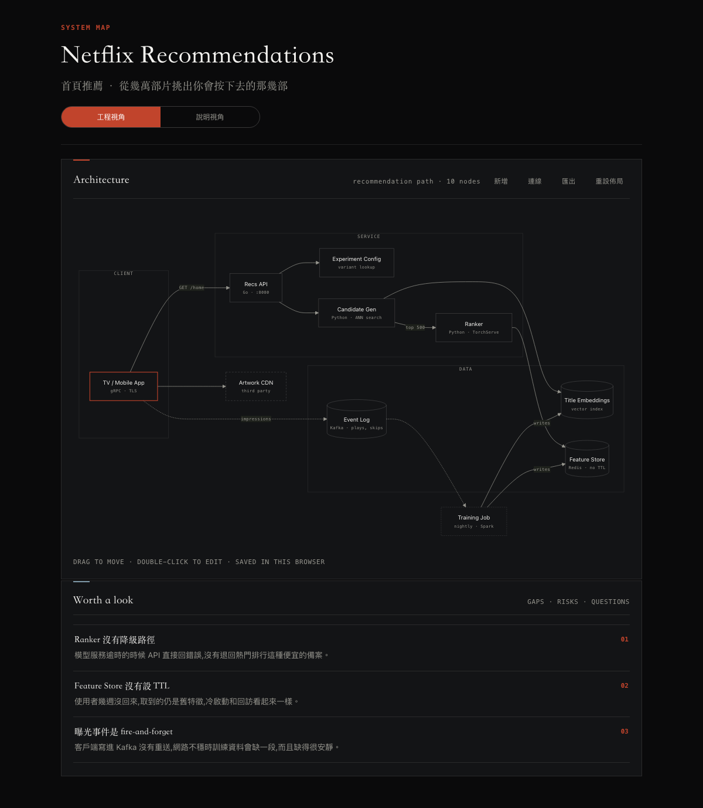
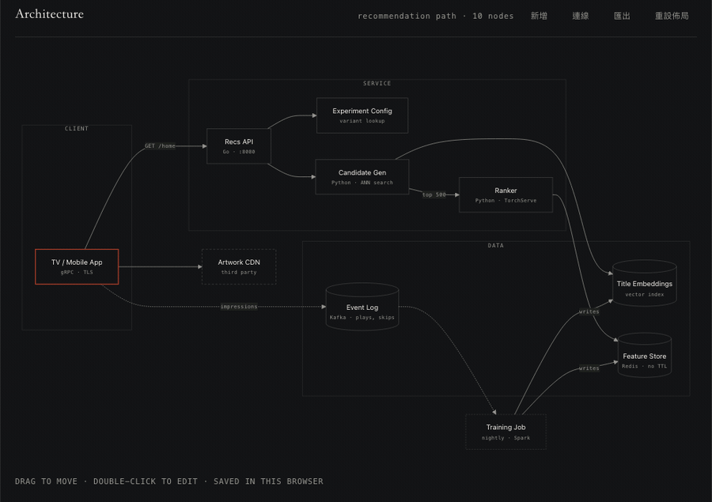
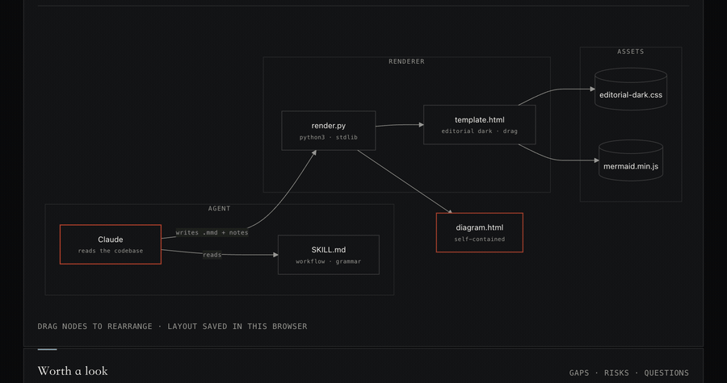

<h1 align="center">Clean Diagram</h1>

<p align="center">
  
</p>

<p align="center">
  
</p>

<p align="center">
  <b>Editable html architecture with agent.</b><br>
  Built for software architecture. Easy work with agent.
</p>

<p align="center">
  <a href="LICENSE"></a>
</p>

<p align="center">
  🇬🇧 · <a href="README.zh-TW.md">🇹🇼</a>
</p>



## What you get

**1. Engineer view** — modules, dependencies, data flow. The second line holds language, protocol, port.

**2. Worth a look**

## The page is editable

Carries the Mermaid source it was drawn from, so a
diagram that came out 90% right can be finished by hand instead of re-prompted.



| | |
|---|---|
| Move | drag a node; edges re-route |
| Rename | double-click the label, type, Enter |
| Add / connect | `Add` puts a node down · `Connect` clicks two nodes into an edge |
| Delete | select a node or an edge, then Delete |
| Take it back | `Export` copies the Mermaid source to your clipboard |
| Start over | `Reset layout` drops both the layout and the edits |

Edits are saved live in your browser. Use `Export` and paste into
the `.mmd` to keep them.



## Install

Claude Code:

```
/plugin marketplace add adiolk98/clean-diagram
/plugin install clean-diagram
```

| Harness | Where |
|---|---|
| Cursor | `cp -r skills/clean-diagram ~/.cursor/skills/` (project: `.cursor/skills/`) |
| Codex CLI | `cp -r skills/clean-diagram ~/.codex/skills/` |
| Claude Code (no plugin) | `cp -r skills/clean-diagram ~/.claude/skills/` |
| Anything else (Gemini CLI, aider, Copilot…) | clone the repo and tell the agent: *follow `skills/clean-diagram/SKILL.md`* |

## Use

ask:

```
draw the architecture of this repo
draw the architecture of src/payments
draw one, and one I can show my boss
```

If the scope is unclear it asks one question, then hands you an HTML file path.
Mermaid is inlined — the file opens offline, no CDN.

Example output: [`examples/streaming-recs.html`](examples/streaming-recs.html) —
a streaming recommendation path, made up for the demo.

## Running directly

Works without an agent:

```bash
python3 skills/clean-diagram/scripts/render.py engineer.mmd out.html \
  --title "Streaming Recommendations" --subtitle "home row · picking a few from tens of thousands" \
  --scope "recommendation path · 10 nodes" \
  --notes notes.txt --plain plain.mmd --explain explain.txt
```

Only `--title` and the first `.mmd` are required. `--notes` takes one line per note
(`Title :: what to look at`), `--plain` is the second diagram, `--explain` its
write-up (blank line = new paragraph).

The Mermaid source adds four role classes:

```
classDef entry fill:transparent
classDef store fill:transparent
class App entry
class Feat,Emb store
```

The page stylesheet does the painting — `classDef` values are ignored, so no hex
codes get pasted into every diagram.

Layout: `assets/template.html` is the page skeleton, `assets/diagram.css` the
diagram and editing styles, `assets/diagram-src.js` the (pure) Mermaid text
surgery, `assets/diagram.js` the drag/edit/export behaviour. `render.py` inlines
all of them into one file.

## Contributing

See [CONTRIBUTING.md](CONTRIBUTING.md).

## License

MIT — see [LICENSE](LICENSE). The inlined Mermaid is MIT too — see [THIRD_PARTY.md](THIRD_PARTY.md).
